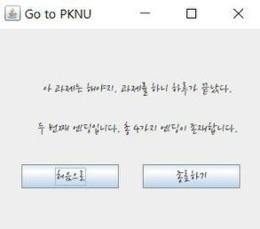

# Someone’s Choice(ver.Student)

## INDEX

1. Introduction 
2. Diagrams 
3. Result 
4. Caution &Info.

## 1.Introduction

 "BlackMirror: Bandersnatch", which is the Netflix original movie, inspired me to create an imitation. This program is controlled by our choice like the movie.You can seek to endings in the program. In the program, 4-endings are existed. Actually, you can find all of them easily. Finally, this report have had two versions about program code. Firstcode is easy to make me coding easily. But that’s not concerning about the program’s view and has a lot of overheading. Second code is opposition. It is easy to draw a diagram and more  programfully. So I will introduce the process making this JAVA program.

## 2.Diagrams

* That is the class diagram of first program. It doesn’t have any association among classes, and even these are all pubic classes.

* So I minimalize the diagram newly. That is the class diagram of second program. It is more simple than the first. Below, Start Class have "Main" which use Set_Font Class. But, it doesn’t help us to understand it well.Other diagrams can explain the process of the program.

* It is a Use-Case diagram.That is simple and we can understand how to someone use the program. “User -> Start -> processing(Choice) -> Ending” It is not also enough to explaing the program.

* It is a Siquence diagram. Actually, it doesn’t match to this program. Below, the numbers, “1~13”, aremessages. Normal programmers don’t use the message like below that. I made the diagram although the diagram is not correct. Because I thought that is more simple and understandful.(All messages’ method names are same as the classname like each constructor.)

  

  

* Finally! It is a Activity diagram. It is real useful and the most informative diagram in the program. That is like ‘Flowchart’.

  

## 3. Result

## 4. Caution & Info.

* If hadn’t installed “더페이스샵잉크립퀴드체”, the program would have used 
  the default letter shape.

* Difficulty : Button event control is complex because of continueing next page. For example, “교통수단 선택 -> 지하철, 버스 -> 음악 듣기 선택 -> 듣기, 안 듣기”, it seems like just one process but, not equal to the choices. So that is difficult to me about setting each other.

* Prominent Analysis

  1. What I learn about is Button event have a lot of methods.

  2. ‘dispose()’ function in java frame is very useful to make the another page and exit only one page,not out all pages.

* Next move
  1. Student class - It will have an information about an user.
  2. Data - Making storyline you have choosen will be stored using the text files or databases.
  3. Choices - Other choices will be added even secret stuff like easter eggs. 
  4. Version - Not only ver.student.